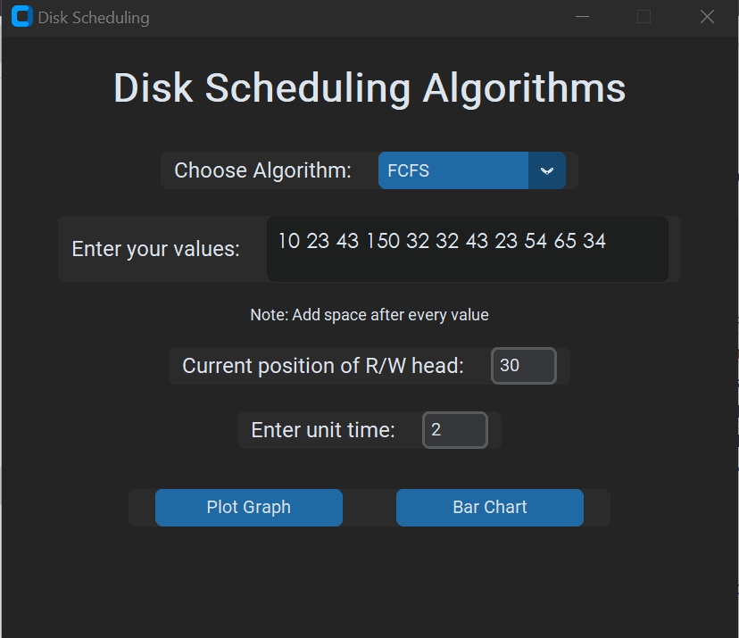
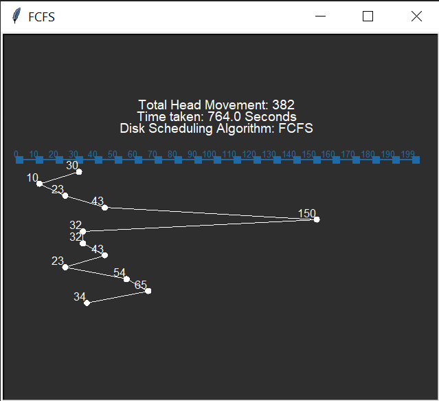
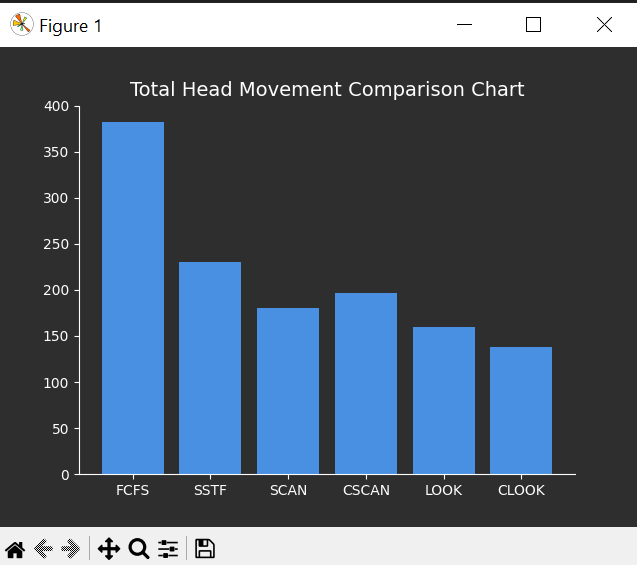

# Disk Scheduling Algorithm Visualizer
This project is a Python-based visualizer for disk scheduling algorithms. It provides a graphical user interface (GUI) to simulate and compare different disk scheduling algorithms, including **FCFS, SSTF, SCAN, CSCAN, LOOK,** and **CLOOK**. The visualizer uses **customtkinter** for the GUI, **turtle** for visualizing the disk head movements, and **matplotlib** for plotting a comparison chart of total head movements.

### Features
- **Six Disk Scheduling Algorithms:**
    - FCFS (First-Come, First-Served)

    - SSTF (Shortest Seek Time First)

    - SCAN

    - CSCAN

    - LOOK

    - CLOOK

- **Interactive GUI:**

    Built using customtkinter for a modern and customizable interface.
    Allows users to input disk requests, select algorithms, and specify the starting position and unit time.

- **Visualization:**

    Uses the turtle library to visualize the disk head movements for the selected algorithm.
    Displays the order of requests, total head movement, and time taken.

- **Comparison Chart:**

    Uses matplotlib to plot a bar chart comparing the total head movements of all six algorithms.

- **Error Handling:**

    Ensures valid inputs (e.g., no negative values for start position or unit time).

### How It Works
**Input:**

Enter disk requests as space-separated values (e.g., 98 183 37 122 14 124 65 67).

Specify the current position of the read/write head.

Provide the unit time (used to calculate the total time taken).

**Visualization:**

Select an algorithm from the dropdown menu.

Click Plot Graph to visualize the disk head movements using turtle.

**Comparison:**

Click Bar Chart to generate a comparison chart of total head movements for all algorithms using matplotlib.

